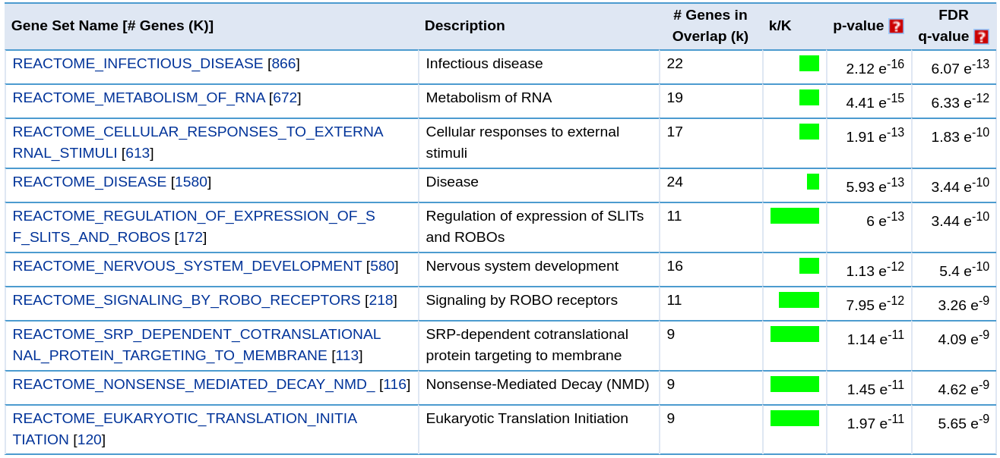
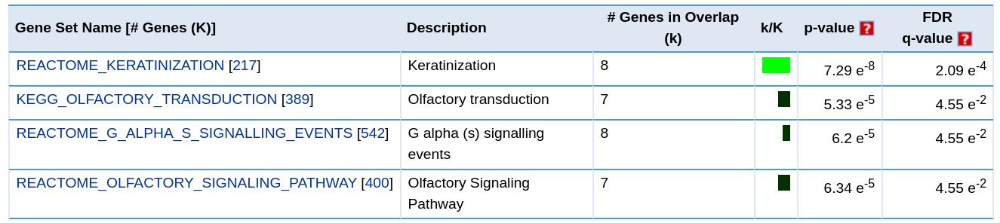

```{r setup, include=FALSE}
knitr::opts_chunk$set(echo = T, warning = F, message = F)
```

```{r}
library(data.table)
library(ggplot2)
library(dplyr)
library(tidyr)
library(rehh)
```

## 1
Provided the following set of sequences, draw the EHH plots for each allele (a and A) (given that core SNP is at position 0) [by hand/in Paint/in R - at your choice]. When drawing the plot, calculate the allele-specific EHH - that is, treat sets of sequences for each allele independently

```{r}
df <- fread('task_1.tsv')
knitr::kable(df)
```

I prepared the functions for EHH calculation:

```{r}
get_regs <- function(delim, positions, stop_slice) {
  target_reg <- substr(positions, 1, stop_slice)
  n_all <- sapply(unique(target_reg), function(x) sum(stringr::str_detect(x, target_reg)))
  delim * sum(sapply(n_all, function(n) n * (n - 1)))
}

calculate_ehh <- function(positions, nas) {
  delim <- 1 / (nas * (nas - 1))
  sapply(2:nas, function(x) get_regs(delim, positions, stop_slice=x))
}
```

Calculated EHH values:

```{r}
ehh <- c(calculate_ehh(df$a, nas=6), calculate_ehh(df$A, nas=6)) %>% 
  as.data.frame() %>% 
  mutate(Allele = factor(sapply(c('a', 'A'), function(x) replicate(5, x)))) %>% 
  mutate(t = c(replicate(2, 1:5))) %>% 
  magrittr::set_colnames(c('EHH', 'Allele', 't'))
knitr::kable(ehh)
```

EHH plot:

```{r}
ggplot(ehh, aes(x = t, y = EHH, col=Allele))+
  geom_step(linetype=2)+
  geom_point()+
  theme_bw()+
  theme(aspect.ratio = 1)+
  ggtitle('EHH plot')
```

Since EHH values don't tend to zero for allele **A**, this allele is assosiated with positive selection (we can find ~shared haplotypes for this one).

## 2

Let’s mine some data in public resources. Using gnomAD browser (https://gnomad.broadinstitute.org/) find some data for your favorite protein-coding human gene. gnomAD provides summary gene constraint statistics at the top of gene page. Look at the observed and expected counts of synonymous, missense, and loss-of-function (pLoF) SNPs. Is your gene evolutionary conserved? What is the evidence for your conclusion?

Let's check *ACTB* gene statistics:

\begin{figure}[h!]
\includegraphics[width=0.75\textwidth]{plots/actb.png}
\caption{GnomAD: ACTB}
\end{figure}

Since there are too few missence SNVs and pLoF = 0, *ACTB* is a highly evolutionary conserved gene.

Otherwise, *PTPRC* gene looks as a non-conservative gene from the evolution point of view:
\begin{figure}[h!]
\includegraphics[width=0.75\textwidth]{plots/ptprc.png}
\caption{GnomAD: PTPRC}
\end{figure}

## 3

dN/dS value is usually calculated in a rigorous fashion, comparing the observed and expected frequencies of synonymous and non-synonymous substitutions. Nevertheless, we can use the dN/dS logic to calculate a simpler value which I call f(N)/f(S) = sum(AFnonsynonymous variants)/sum(AFsynonymous variants). This value can not be interpreted as dN/dS, but can still be used to rank genes with the highest selective pressure. You are provided with a file ESP_SNP_data.tsv, which contains filtered data about coding variant sites from the Exome Sequencing Project by NHLBI. Write a short custom script to evaluate f(N)/f(S) value for each gene (remove all genes without synonymous variants).

Read data, change *STOP_GAINED* effect to *NON_SYNONYMOUS_CODING*

```{r}
df <- fread('ESP_SNP_data.tsv') %>% 
  mutate(EFF = ifelse(grepl('STOP', EFF), 'NON_SYNONYMOUS_CODING', EFF))
knitr::kable(df %>% head(3))
```

Genes without synonymous variants (=> f(N) / f(S) = Inf since f(S) = 0) were removed

```{r}
metric <- df %>% group_by(GENE) %>%
  summarise(metric = sum(AF[EFF == "NON_SYNONYMOUS_CODING"]) / sum(AF[EFF == "SYNONYMOUS_CODING"])) %>% 
  filter(metric != Inf)

knitr::kable(metric %>% head())
```
1) Draw the distribution of the resulting f(N)/f(S) values. What is the mean value of this metric?

```{r}
ggplot(metric, aes(x = log10(metric + 1)))+
  geom_histogram(bins=30, fill='white', col='black')+
  theme_bw()+
  ggtitle(sprintf('mean(fN / fS) = %f', mean(metric$metric)))+
  theme(aspect.ratio = 1, plot.title = element_text(hjust = 0.5))
```

2) Provide a list of top-100 genes with lowest and highest values of the calculated metric.

(a) most conserved genes

```{r}
cons_genes <- metric %>% arrange(metric) %>% head(100)
write.table(cons_genes$GENE, file='conserved_genes.txt', row.names = F, col.names = F, quote = F)
DT::datatable(cons_genes)
```

(b) least conserved genes?

```{r}
non_cons_genes <- metric %>% arrange(-metric) %>% head(100)
write.table(non_cons_genes$GENE, file='non_conserved_genes.txt', row.names = F, col.names = F, quote = F)
DT::datatable(non_cons_genes)
```

3) Run MSigDB (http://software.broadinstitute.org/gsea/msigdb/annotate.jsp) analysis using each list of genes (separately) against canonical pathway (CP) list.
What are the functional terms associated with highest and lowest conservation? Can you give any biological reasoning for this observation?

**Conservative genes**:


**Non-conservative genes**:



Evolutionary conserved genes are associated with pathways which are essential for important biological processed, e.g., translation initiation, RNA metabolism, etc.

Genes which are not conserbed based on fN / fS metrics assosiated with some both signalling and transduction processes: since these processes can be somehow connected with the environment, population history and so on, it is not surprising that genes overlap with such pathways are variable.